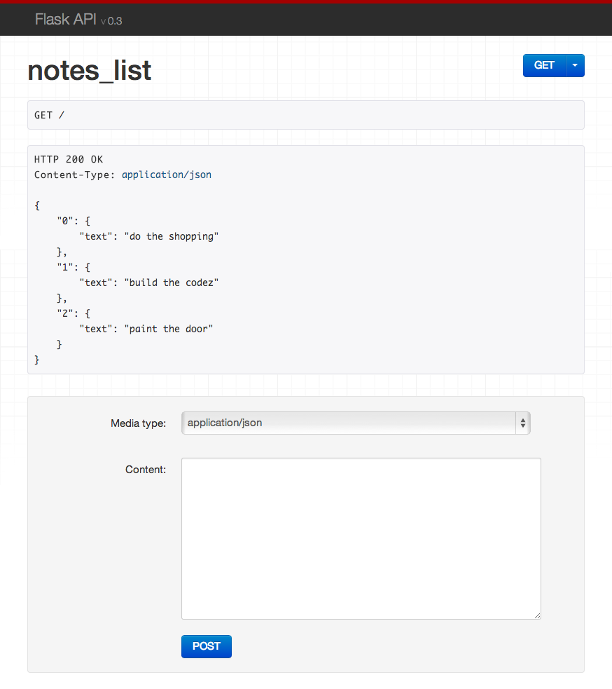

# FlaskAPI

**Work in progress**

[![Build Status][travis-image]][travis-link]
[![Coverage Status][coveralls-image]][coveralls-link]

## Installation

Requirements:

* Python 2.7 or 3.3.
* Flask 0.10.

Install using `pip`.

    pip install flaskapi

Import and initialize your application.

    from flaskapi import FlaskAPI

    app = FlaskAPI(__main__)

## Returning responses

Return any valid response object as normal, or return a `list` or `dict`.

    @app.route('/example/')
    def example():
        return {'hello': 'world'}

A renderer for the response data will be selected using content negotation based on the client 'Accept' header. If you're making the API request from a regular client, this will default to a JSON response. If you're viewing the API in a browser it'll default to the browsable API HTML. 

## Request data

Access the parsed request data using `request.data`.  This will handle JSON or form data by default.

    @app.route('/example/')
    def example():
        return {'request data': request.data}

## A full example

The following example demonstates a simple API for creating, listing, updating and deleting notes.

    from flask import request
    from flaskapi import FlaskAPI, status, exceptions

    app = FlaskAPI(__name__)

    notes = {
        0: {'text': 'do the shopping'},
        1: {'text': 'build the codez'},
        2: {'text': 'paint the door'},
    }

    @app.route("/", methods=['GET', 'POST'])
    def notes_list():
        if request.method == 'POST':
            note = {'text': str(request.data.get('text', ''))}
            idx = max(notes.keys()) + 1
            notes[idx] = note
            return note, status.HTTP_201_CREATED

        # request.method == 'GET'
        return notes

    @app.route("/<int:key>/", methods=['GET', 'PUT', 'DELETE'])
    def notes_detail(key):
        if request.method == 'PUT':
            note = {'text': str(request.data.get('text', ''))}
            notes[key] = note
            return note

        elif request.method == 'DELETE':
            notes.pop(key, None)
            return '', status.HTTP_204_NO_CONTENT

        # request.method == 'GET'
        if key not in notes:
            raise exceptions.NotFound()
        return notes[key]

    if __name__ == "__main__":
        app.run(debug=True)

Now run the webapp:

    $ python ./example.py
     * Running on http://127.0.0.1:5000/
     * Restarting with reloader

You can now interact with the API both from the command line:

    $ curl -X GET http://127.0.0.1:5000/
    {"0": {"text": "do the shopping"}, "1": {"text": "build the codez"}, "2": {"text": "paint the door"}}

And from your web browser:

[travis-image]: https://travis-ci.org/tomchristie/flaskapi.png?branch=master
[travis-link]: https://travis-ci.org/tomchristie/flaskapi
[coveralls-image]: https://coveralls.io/repos/tomchristie/flaskapi/badge.png?branch=master
[coveralls-link]: https://coveralls.io/r/tomchristie/flaskapi?branch=master
