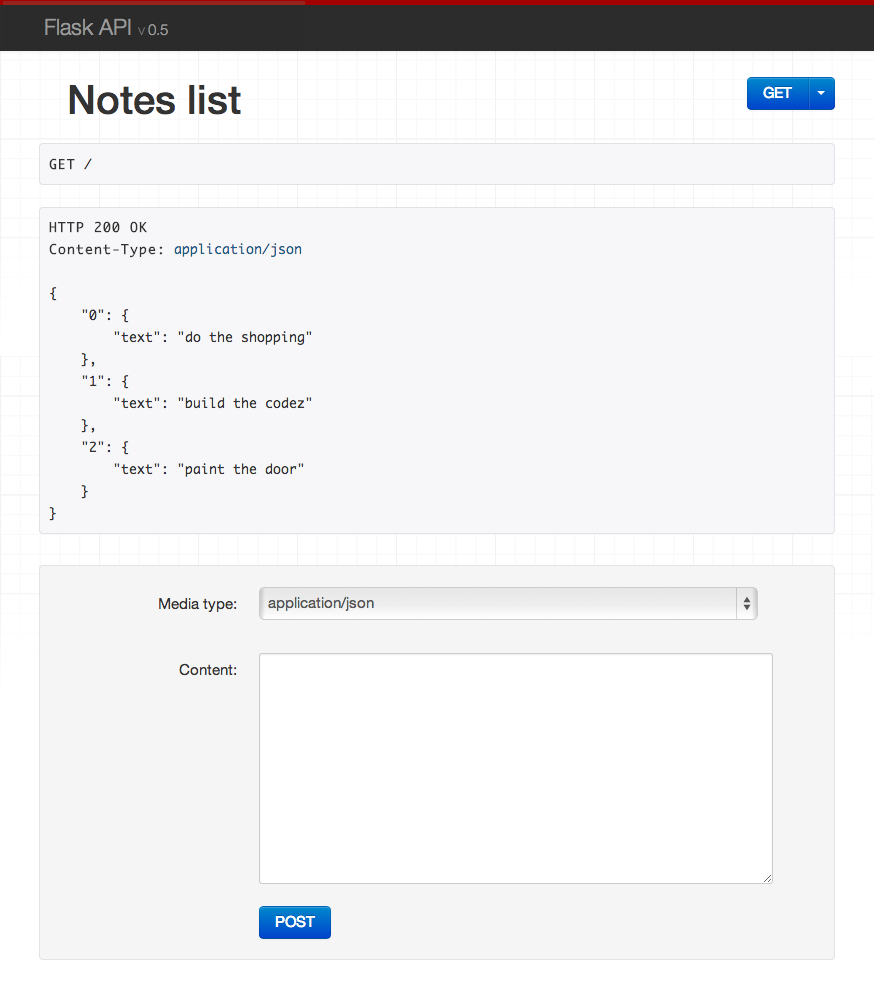

# Flask API

Browsable Web APIs for Flask

---

## Overview

Flask API is a drop-in replacement for Flask that provides an implementation of browsable APIs similar to what [Django REST framework](http://www.django-rest-framework.org) provides. It gives you properly content negotiated-responses and smart request parsing:

## Installation

Requirements:

* Python 3.6+
* Flask 1.1+

The following packages are optional:

* Markdown (`2.6+`): Markdown support for the browsable API

Install using `pip`:

    pip install Flask-API

Import and initialize your application:

    from flask_api import FlaskAPI

    app = FlaskAPI(__name__)

## Responses

Return any valid response object as normal, or return a `list` or `dict`.

    @app.route('/example/')
    def example():
        return {'hello': 'world'}

A renderer for the response data will be selected using content negotiation based on the client 'Accept' header. If you're making the API request from a regular client, this will default to a JSON response. If you're viewing the API in a browser it'll default to the browsable API HTML.

## Requests

Access the parsed request data using `request.data`.  This will handle JSON or form data by default.

    @app.route('/example/')
    def example():
        return {'request data': request.data}

## Example

The following example demonstrates a simple API for creating, listing, updating and deleting notes.

    from flask import request, url_for
    from flask_api import FlaskAPI, status, exceptions

    app = FlaskAPI(__name__)

    notes = {
        0: 'do the shopping',
        1: 'build the codez',
        2: 'paint the door',
    }

    def note_repr(key):
        return {
            'url': request.host_url.rstrip('/') + url_for('notes_detail', key=key),
            'text': notes[key]
        }

    @app.route("/", methods=['GET', 'POST'])
    def notes_list():
        """
        List or create notes.
        """
        if request.method == 'POST':
            note = str(request.data.get('text', ''))
            idx = max(notes.keys()) + 1
            notes[idx] = note
            return note_repr(idx), status.HTTP_201_CREATED

        # request.method == 'GET'
        return [note_repr(idx) for idx in sorted(notes.keys())]

    @app.route("/<int:key>/", methods=['GET', 'PUT', 'DELETE'])
    def notes_detail(key):
        """
        Retrieve, update or delete note instances.
        """
        if request.method == 'PUT':
            note = str(request.data.get('text', ''))
            notes[key] = note
            return note_repr(key)

        elif request.method == 'DELETE':
            notes.pop(key, None)
            return '', status.HTTP_204_NO_CONTENT

        # request.method == 'GET'
        if key not in notes:
            raise exceptions.NotFound()
        return note_repr(key)

    if __name__ == "__main__":
        app.run(debug=True)

Now run the webapp:

    $ python ./example.py
     * Running on http://127.0.0.1:5000/
     * Restarting with reloader

You can now open a new tab and interact with the API from the command line:

    $ curl -X GET http://127.0.0.1:5000/
    [{"url": "http://127.0.0.1:5000/0/", "text": "do the shopping"}, {"url": "http://127.0.0.1:5000/1/", "text": "build the codez"}, {"url": "http://127.0.0.1:5000/2/", "text": "paint the door"}]
    $ curl -X GET http://127.0.0.1:5000/1/
    {"url": "http://127.0.0.1:5000/1/", "text": "build the codez"}
    $ curl -X PUT http://127.0.0.1:5000/1/ -d text="flask api is teh awesomez"
    {"url": "http://127.0.0.1:5000/1/", "text": "flask api is teh awesomez"}

You can also work on the API directly in your browser, by opening <http://127.0.0.1:5000/>.  You can then navigate between notes, and make `GET`, `PUT`, `POST` and `DELETE` API requests.
